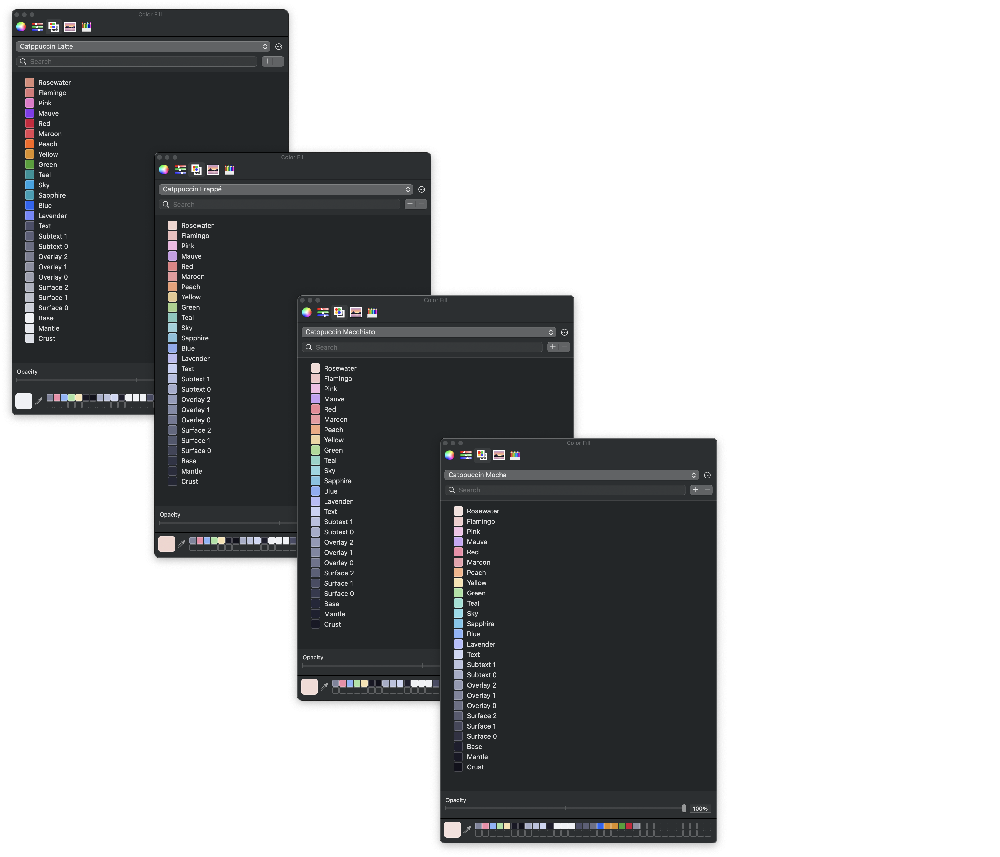
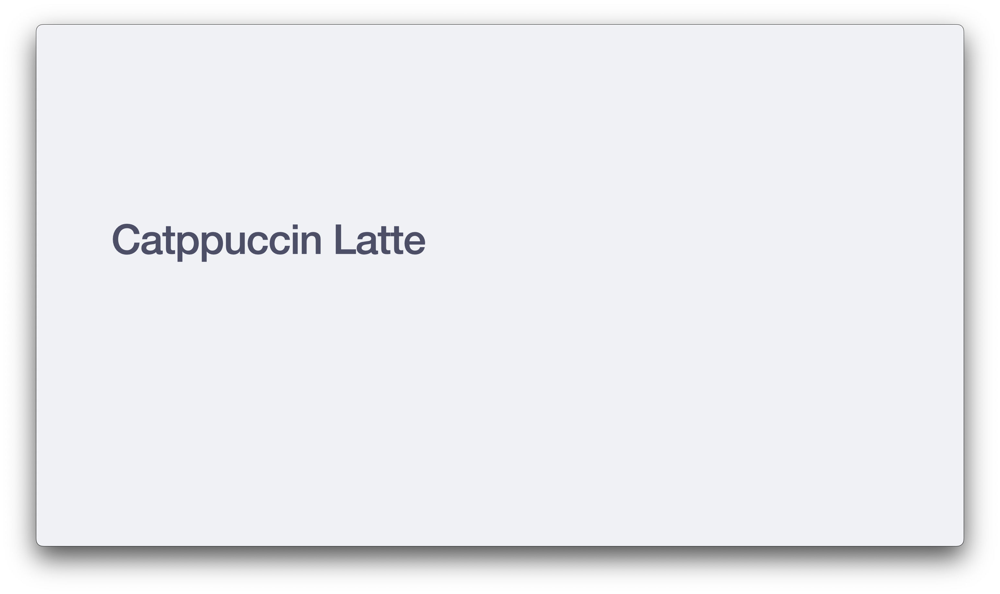
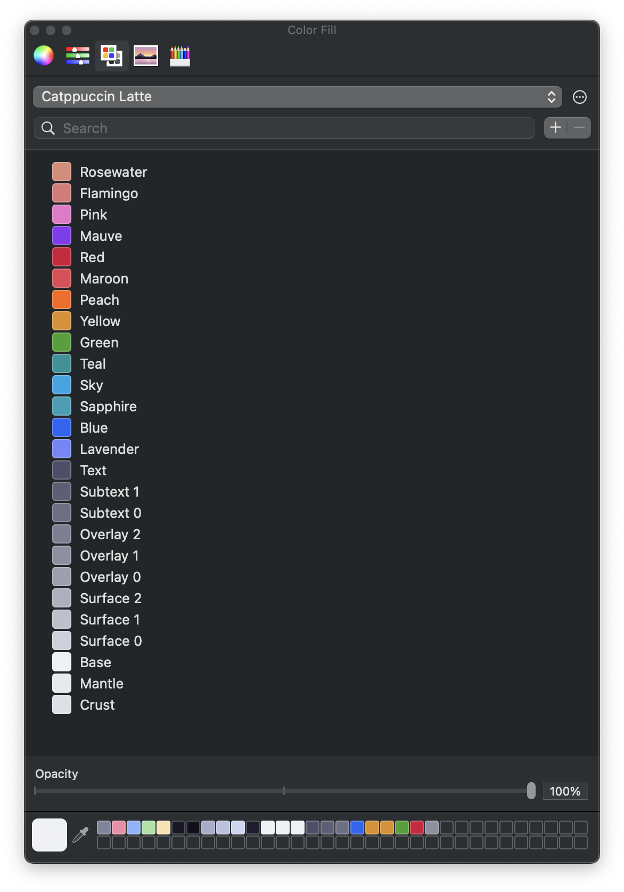
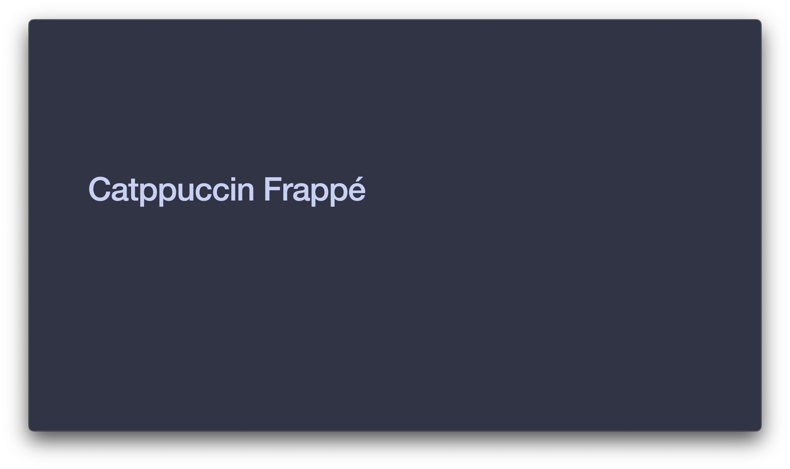
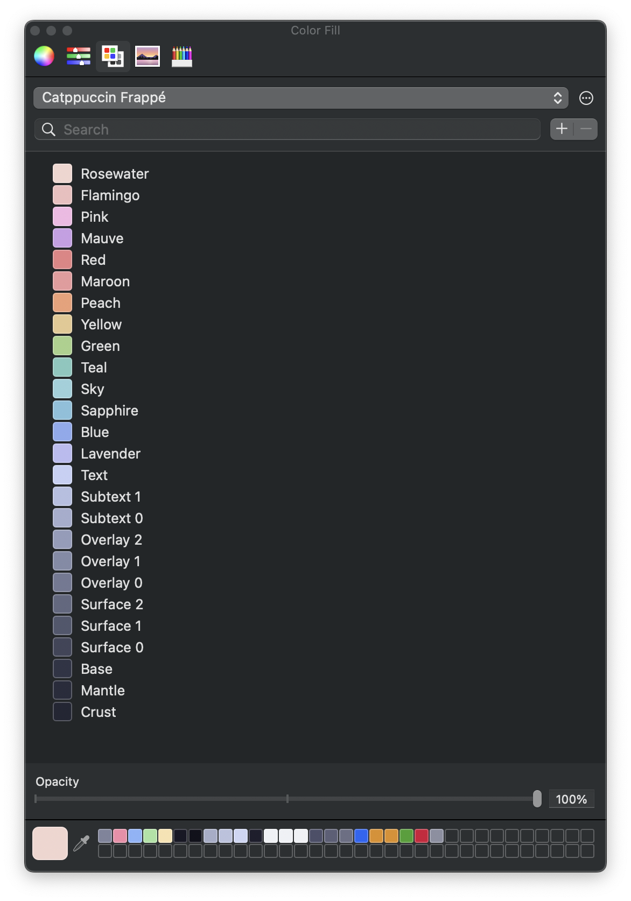
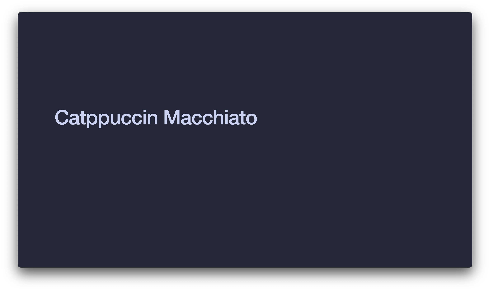
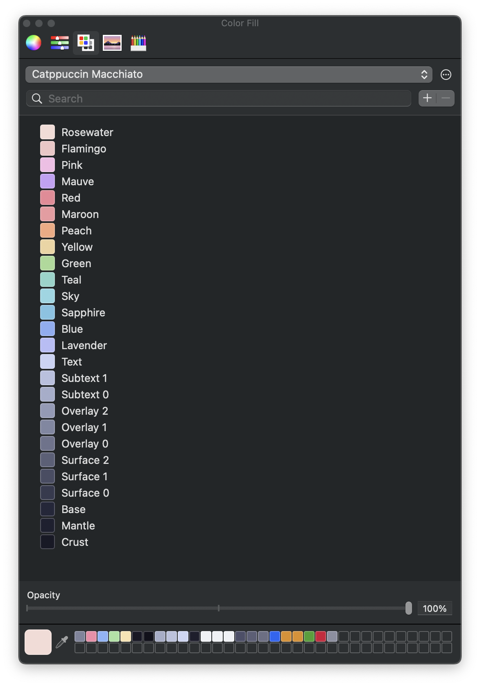
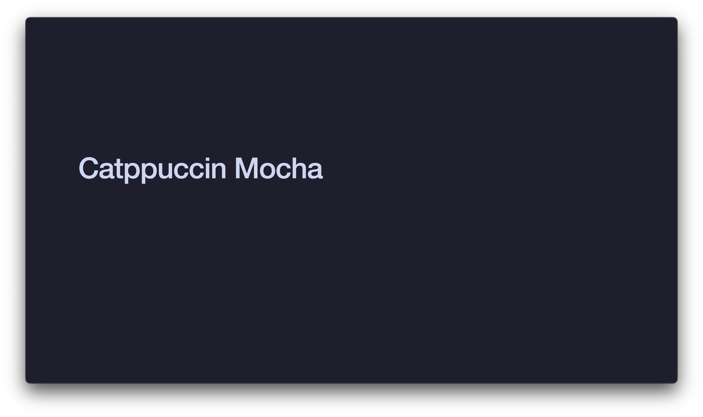
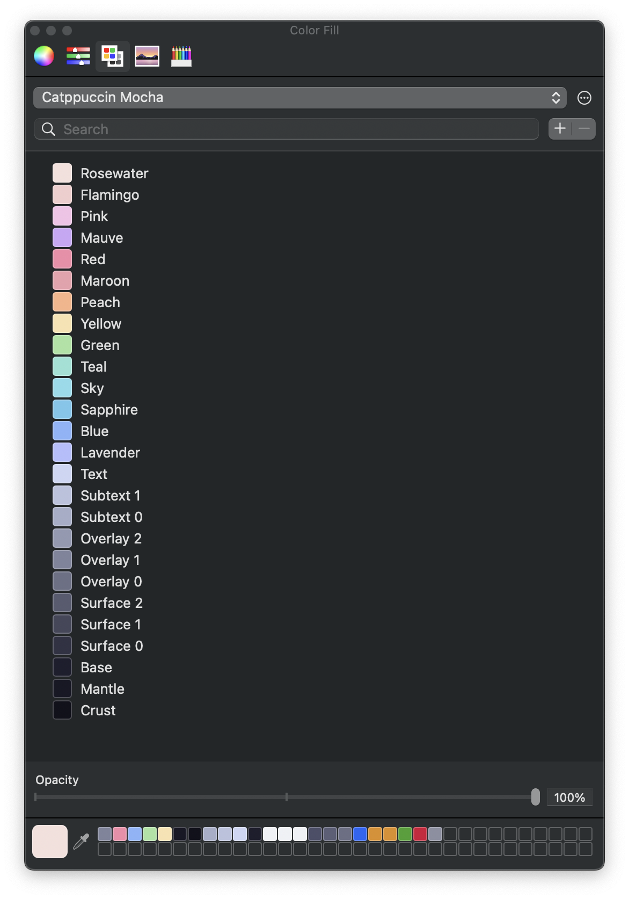

<h3 align="center">
	 
	
	Catppuccin for <a href="https://github.com/stevin-wilson/iwork">iWork</a>
	
</h3>

	
	
	

## Apple Color Lists

	

## Keynote Themes

	

## Previews

🌻 Latte

🪴 Frappé

🌺 Macchiato

🌿 Mocha

## Usage

### Apple Color Lists

To use the Catppuccin color palettes in macOS applications:

1. Navigate to the `palettes` subfolder and download the desired `.clr` file.
2. Move the downloaded `.clr` file to the `~/Library/Colors` directory.
3. The color palette will now be available in the Apple Color Picker across compatible applications.

### Keynote Themes

To use the Catppuccin Keynote themes:

1. Navigate to the `keynote-themes` subfolder and download the desired `.kth` file.
2. Double-click the downloaded file to install and use the theme in your Keynote presentations.

## 💝 Thanks to

- [Stevin Wilson](https://github.com/catppuccin)

&nbsp;

	

	Copyright &copy; 2021-present <a href="https://github.com/catppuccin" target="_blank">Catppuccin Org</a>

	

# iwork
