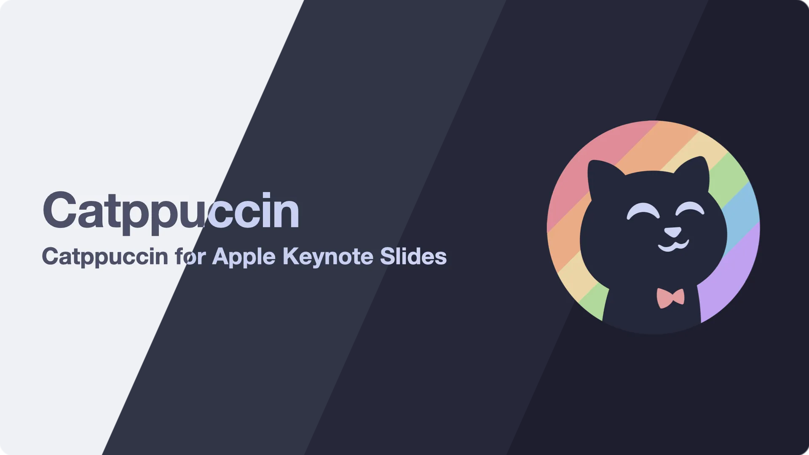

<h3 align="center">
	 
	
	Catppuccin for <a href="https://github.com/stevin-wilson/keynote-slides">Apply Keynote Slides</a>
	
</h3>

	
	
	

## Keynote Themes

	

## Previews

🌻 Latte

🪴 Frappé

🌺 Macchiato

🌿 Mocha

## Usage

To use the Keynote themes:

1. Navigate to the `Catppuccin` subfolder and download the desired `.kth` file.
2. Double-click the downloaded file to install and use the theme in your Keynote presentations.

__Note:__ The Catppuccin color palette is available as an Apple Color List (.clr) at [catppuccin/palette](https://github.com/catppuccin/palette). You can add it to macOS’s color picker for consistency across applications.

## 💝 Thanks to

- [Stevin Wilson](https://github.com/catppuccin)

&nbsp;

	

	Copyright &copy; 2021-present <a href="https://github.com/catppuccin" target="_blank">Catppuccin Org</a>

	

# keynote-slides
